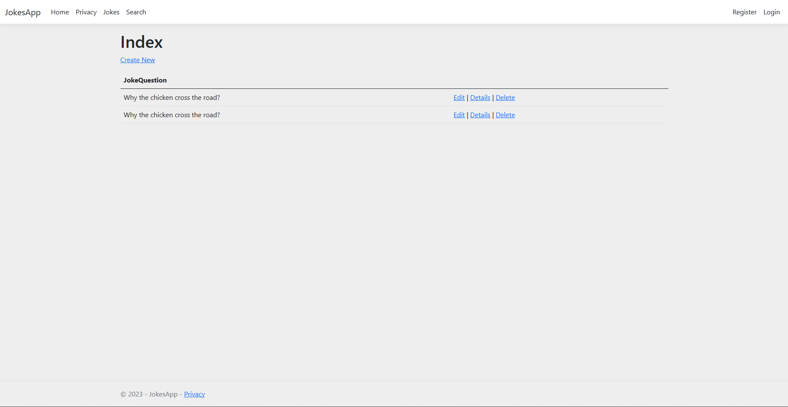

# JokesApp

# OverView

To create basic application to gain more knowledge on ASP.NET with C#.



# MVP

* To implement CRUD Operations in ASP.NET with C#.

# Tech Stack

* C Sharp (C#)

# Build Steps

```
cd JokesApp
```

# Features

* Basic CRUD operations implemented in ASP.NET with C# to gain more knowledge on them. 
* Implemented Create, Retrieve, Edit and Delete Operations.
* Implemented Authorisation to create a Joke.
* Home Page acts as a welcome Page in this application.
* Added Jokes Link to Navbar to view all Jokes.
* Added Search Link to Navbar which takes input to search for Jokes.
